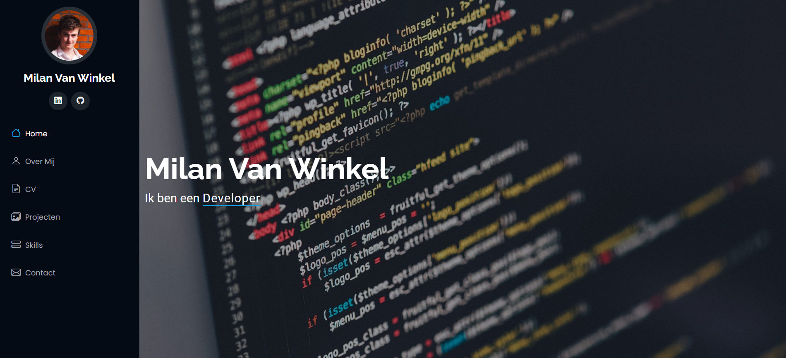

# Portfolio
## 📌 Over dit project
Deze repository bevat de volledige source code van mijn [portfolio website](https://www.milanvanwinkel.be), waarin ik mijn studies, ervaring, projecten en vaardigheden presenteer.

Dit project wordt actief onderhouden en voortdurend aangepast naarmate mijn vaardigheden en ervaring groeien.

## 🎯 Doel van het project
Dit portfolio is ontwikkeld als eindproject voor mijn jurymoment in juni 2025. Het doel was om een professionele en dynamische website te bouwen waarop ik mijn technische vaardigheden, projecten en ervaringen kan presenteren.

## 🧠 Motivatie
Ik had in het verleden al een portfolio website gebouwd in de beginfase van mijn opleiding, maar deze was volledig statisch opgebouwd met HTML, CSS en Bootstrap.

Na het afronden van mijn werkplekleren in mei 2025, besloot ik voor mijn jurymoment een meer geavanceerde en professionele oplossing te bouwen. Ik ben gestart vanaf nul, maar heb na enkele dagen gekozen om te werken met een bestaande template als basis.

Achteraf gezien was dit een goede keuze, omdat het eindresultaat positief werd ontvangen door de juryleden.
 

## 🕒 Wanneer ben ik begonnen aan dit project?
Dit project is gestart eind mei 2025 en wordt tot op heden nog steeds verder geüpdatet en verbeterd.

## 🛠️ Technologieën
- Laravel (PHP framework)
- PHP
- Blade templating engine
- MySQL (Eloquent ORM)
- CSS
- JavaScript
- Composer
- HTML
- Tailwind CSS
- Bootstrap
- Node.js & npm

## 📁 Projectstructuur
De website is opgebouwd volgens het MVC-patroon van Laravel:
- **Models**: halen data op uit de gekoppelde MySQL database via Eloquent ORM
- **Views**: opgebouwd met Blade templates
- **Controllers**: behandelen de logica en verschillende acties omtrent dataverwerking

Alle inhoud (projecten, opleidingen, werkervaring en skills) worden dynamisch vanuit de database ingeladen.

## ⚙️ Installatie & setup

Volg deze stappen om het project lokaal te draaien:

```bash
git clone https://github.com/MilanVW-Personal/portfolio-2025_v2.git
cd portfolio-2025_v2

composer install
npm install

cp .env.example .env
php artisan key:generate

php artisan migrate --seed

npm run dev
php artisan serve
```
### Vereisten
- PHP 8+
- Composer
- Node.js & npm
- MySQL


## 🔮 Toekomstige verbeteringen
- Meertaligheid toevoegen aan de website
- Detailpagina's per project

## 📸 Screenshots
Hieronder staat een screenshot van de landing page van het portfolio.


## 🌐 English version
To those who are English speaking, you can read the translated version of this README by selecting the `README_EN.md` file.